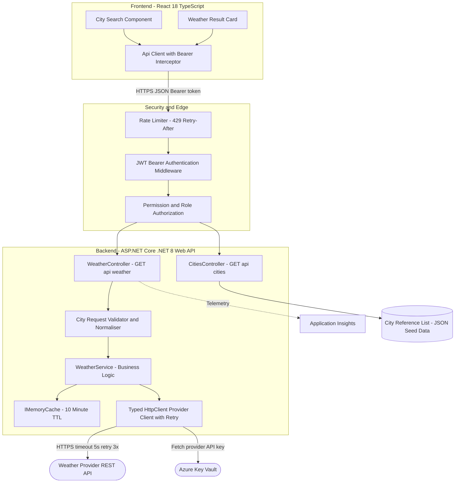
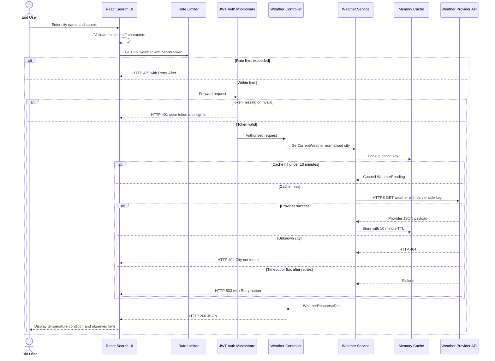

# **1. Introduction**

## **1.1 Purpose**

Users today have no lightweight, trustworthy way inside our estate to look up the current temperature for a named city without visiting an external consumer weather site. The City Weather Lookup Application (Azure DevOps Epic 2327) closes that gap by delivering a small, secure, token-protected web application where a user types a city name and immediately sees its current temperature, weather condition and observation time.

The solution is scoped as a React (TypeScript) single-page frontend backed by an ASP.NET Core (.NET 8) Web API that brokers all calls to a third-party weather provider (assumed OpenWeatherMap). The backend exists specifically so that the provider API key never leaves server-side configuration, so that city input is validated and normalised consistently, and so that provider quota is protected by server-side caching and per-client rate limiting. Business Impact & Key Decisions: brokering through our own API rather than calling the provider directly from the browser is the single most important decision in this design - it is what makes User Story 2345 ("no key present in client code or network responses") achievable, and it is what allows the ten-minute cache in User Story 2337 to cut provider quota consumption across all users rather than per browser.

## **1.2 Scope**

**Functional Scope**: City search with client-side and server-side validation (User Stories 2329, 2335), current-temperature display with condition and last-updated time (User Story 2330), loading/404/5xx state handling with retry (User Story 2331), Celsius-Fahrenheit toggle persisted in localStorage (User Story 2332), `GET /api/weather?city={name}` returning a WeatherResponseDto (User Story 2334), resilient third-party provider integration (User Story 2336), ten-minute in-memory caching keyed by normalised city (User Story 2337), City and WeatherReading JSON schemas (User Story 2339), a backend-served supported-city reference list exposed via `GET /api/cities` with two-character suggestion triggering (User Story 2340), and client-side recent-search chips limited to the last five cities (User Story 2341).

**Non-Functional Scope**: Token-based authentication attached by a React HTTP interceptor with 401-driven token clearing and sign-in redirect (User Story 2343); backend bearer-token validation returning HTTP 401 for missing/invalid tokens and HTTP 403 for valid tokens lacking the required permission (User Story 2344); provider API key held only in server-side secrets, with per-client rate limiting returning HTTP 429 plus a `Retry-After` header (User Story 2345); HTTPS-only transport; accessibility of the result card to keyboard and screen-reader users (User Story 2330); and structured observability through Application Insights and Log Analytics.

**In-Scope Integrations**: The third-party weather provider REST API (assumed OpenWeatherMap) accessed over HTTPS with a server-held key; the token issuer / identity provider whose signed bearer tokens the API validates; Azure Key Vault as the secrets store for the provider API key; and Application Insights with a Log Analytics workspace as the telemetry sink. Browser `localStorage` is treated as an in-scope client-side persistence surface for the unit preference and recent searches, because Epic 2327 explicitly states recent searches are stored client-side.

**Out-of-Scope Items**: There are no user accounts, registration, profile management or password flows - Epic 2327 states explicitly that there is no user identity beyond an API token, so user administration screens are excluded. Native mobile applications are excluded; the React SPA is responsive but browser-delivered. Weather forecasting (multi-day outlook), historical weather analytics, severe-weather alerting, geolocation-based auto-detection, and map or radar visualisation are all excluded because no Feature or User Story under Epic 2327 requires them. A relational database for weather history is also excluded: the only persistent server-side data is the static city reference list, and weather readings live only in the short-lived cache.

**Assumptions & Constraints**: A public third-party weather provider supplies all weather data and is subject to its own vendor quota and availability; our design assumes a free-or-standard tier with a finite request quota, which is precisely why caching and rate limiting are mandatory rather than optional. Temperature is sourced and stored in Celsius, with Fahrenheit derived client-side by conversion so the API contract stays single-unit. The identity provider that issues bearer tokens is assumed to already exist and is consumed, not built. Hosting is assumed to be Azure (Azure Static Web Apps plus Azure App Service) consistent with the governance default technology stack, since Epic 2327 does not name a hosting platform.

## **1.3 Methodology**

Delivery follows an Agile Scrum approach with two-week sprints, driven directly by the Azure DevOps backlog rooted at Epic 2327 and decomposed into four Features (2328 City Search & Weather Display UI, 2333 Weather API, 2338 City & Weather Data Models, 2342 Auth & API Security) and fifteen User Stories. Each User Story carries Given/When/Then acceptance criteria that are used verbatim as the basis for automated test cases, so acceptance criteria act as the contract between the Business Analyst, Architect, Developer and QA roles.

Design review is performed as a single architecture review of this System Design Document before the first implementation sprint, followed by lightweight per-story design confirmation during sprint planning. Significant decisions - brokering the provider through our own API, caching in process memory rather than a distributed cache, serving the city list from a JSON seed rather than a database, and converting units client-side - are recorded as Architecture Decision Records alongside this document in the same repository so that the rationale survives beyond the delivery team.

Tooling: Azure DevOps is the system of record for requirements and traceability; GitHub (`sdlc-city-weather-lookup-application`) is the system of record for architecture artefacts, Mermaid diagram sources, this document and all future source code; Mermaid is used as the diagram-as-code notation so diagrams are version-controlled and reviewable in pull requests; and GitHub Actions is the automation backbone for build, test, scan and deploy.

---

# **2. System Architecture**

## **2.1 Software Architecture**

The solution is a classic three-tier layered architecture with a strict dependency direction: presentation depends on application, application depends on infrastructure, and nothing depends back upwards. The presentation tier is a React 18 TypeScript single-page application composed of a debounced `CitySearchForm`, a `CitySuggestionList` that activates at two typed characters, an accessible `WeatherCard`, a `UnitToggle`, `RecentSearchChips`, and a `LoadingErrorPanel` that renders pending, not-found and failure states with a retry action. All outbound traffic passes through a single `ApiClient` that owns the bearer-token request interceptor and the 401 response interceptor.

The application tier is an ASP.NET Core (.NET 8) Web API exposing exactly two endpoints - `GET /api/weather?city={name}` and `GET /api/cities` - both protected by the same middleware pipeline. A request first meets the rate limiter, then JWT bearer authentication, then permission-based authorization, and only then reaches `WeatherController` or `CitiesController`. `WeatherController` delegates to `CityRequestValidator` for trimming, length bounds and allowed-character checks before `WeatherService` executes business logic. `WeatherService` consults `IMemoryCache` first and only calls `WeatherProviderClient` - a typed `HttpClient` wrapped in a retry-and-timeout policy - on a cache miss.

Interfaces and protocols are deliberately narrow: browser-to-API is HTTPS with JSON payloads and an `Authorization` bearer header; API-to-provider is outbound HTTPS with the key injected from Azure Key Vault via managed identity; API-to-telemetry is the Application Insights SDK over HTTPS. Error semantics are uniform and contract-level: HTTP 400 with a `ProblemDetails` body for validation failures, 401 for missing or invalid tokens, 403 for insufficient permission, 404 for an unknown city, 429 with a `Retry-After` header for throttling, and 503 when the provider remains unavailable after retries.

### **Diagram: Solution Architecture**

**Caption.** This diagram shows how a city search travels from the React frontend, through the security edge (rate limiter, JWT authentication, permission authorization), into the Weather API's controller/validator/service layering, out to the cache or the external weather provider, and finally into Application Insights for telemetry. Its business meaning is containment of risk: the provider key and the provider quota both sit behind our own boundary, so a change of provider, a quota breach, or a provider outage is absorbed by our API rather than reaching the user's browser. Source: `docs/architecture/epic-2327/diagram-architecture.mmd`.

**Textual description.** Six logical groupings exist: Frontend (React components and the single API client), Security Edge (rate limiting, authentication, authorization), Backend (controllers, validator, service, provider client, cache), Data (the JSON city reference list), External (weather provider, Key Vault) and Observability (Application Insights feeding Log Analytics). Every arrow is labelled with its protocol or action, and the only path from the browser to the provider runs through the full security edge.

---

# **3. Detailed Design**

## **3.1 Software Detailed Design**

**Module breakdown.** Frontend: `CitySearchForm` (controlled input, 300 ms debounce, blocks submit below two characters per User Story 2329), `CitySuggestionList` (filters the `/api/cities` payload once two characters are typed, per User Story 2340), `WeatherCard` (renders city name, temperature, condition text and last-updated time with ARIA labelling and full keyboard focus order, per User Story 2330), `UnitToggle` (pure conversion `F = C x 9/5 + 32`, preference written to `localStorage`, per User Story 2332), `RecentSearchChips` (FIFO list capped at five entries in `localStorage`, per User Story 2341), `LoadingErrorPanel` (disables submit while a request is in flight, renders "City not found" on 404 and an error message with a Retry button on 5xx, per User Story 2331), `AuthContext` (token store) and `ApiClient` (interceptors, per User Story 2343).

**Backend classes.** `WeatherController` exposes `GET /api/weather?city={name}` and returns `WeatherResponseDto { city, temperatureCelsius, condition, observedAtUtc }`. `CitiesController` exposes `GET /api/cities` returning an array of `{ id, name, country }`. `CityRequestValidator` enforces: not null, not empty, maximum 100 characters, trims surrounding whitespace and normalises casing before lookup (User Story 2335). `WeatherService` orchestrates cache-then-provider resolution. `WeatherReadingMapper` maps the provider payload onto the internal `WeatherReading` model. `WeatherProviderClient` is a typed `HttpClient` registered with a 5-second timeout and a three-attempt exponential-backoff retry policy (User Story 2336). `GlobalExceptionFilter` converts unhandled exceptions into RFC 7807 `ProblemDetails` so no stack trace reaches a client.

**Key algorithms.** Cache key derivation is `weather:{normalisedCityName}` where normalisation is trim plus invariant lower-casing - this guarantees that "london", " London " and "LONDON" all resolve to one cache entry, which is what makes the ten-minute TTL in User Story 2337 effective rather than cosmetic. Cache lookup precedes every provider call; on a hit within ten minutes the provider is not contacted at all. On a miss, the provider is called, the response is mapped, the entry is written with a ten-minute absolute expiry, and the mapped reading is returned.

**Error handling, idempotency, retries and caching.** Both endpoints are HTTP GET and therefore naturally idempotent and safe to retry; the client Retry button simply re-issues the same request. Retry on the provider edge is bounded at three attempts with exponential backoff and is applied only to timeouts and 5xx responses - a provider 404 is a business outcome (unknown city) and is never retried, it is translated straight to HTTP 404 for the client. When retries are exhausted the API degrades gracefully to HTTP 503 rather than hanging, satisfying User Story 2336. Cache invalidation is purely time-based; there is no manual purge path because weather data is inherently time-decaying and a ten-minute staleness window is acceptable for a current-temperature display.

### **Diagram: Critical Workflow Sequence**

**Caption.** This diagram traces the single highest-value flow in Epic 2327 - a user searching for a city and receiving its current temperature - including the throttling, authentication, validation, cache-hit, cache-miss, unknown-city and provider-failure branches. It matters commercially because every branch shown maps to an acceptance criterion that QA will test, so the diagram doubles as the test-scenario inventory. Source: `docs/architecture/epic-2327/diagram-sequence.mmd`.

**Textual description.** The happy path is eight hops: user submits, client validates length, request passes the rate limiter and token validation, the controller validates and normalises the city, the service checks cache, returns on hit or calls the provider on miss, caches the result, and the UI renders the card and persists the recent search. Four failure branches short-circuit that path: 429 throttling, 401 unauthorised, 404 unknown city and 503 provider unavailable.
