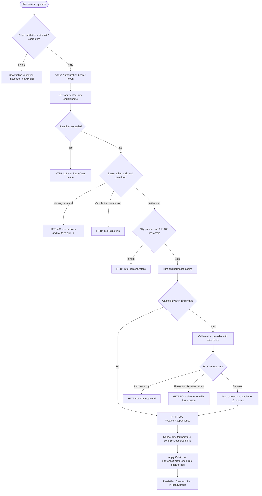
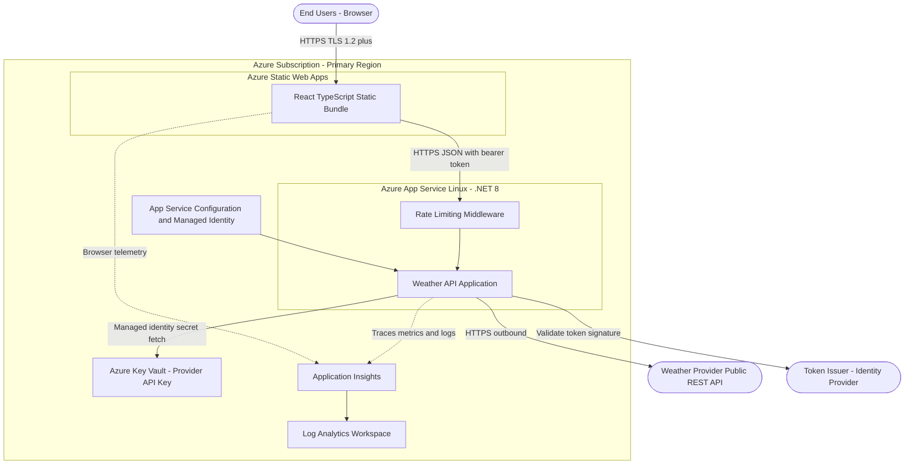
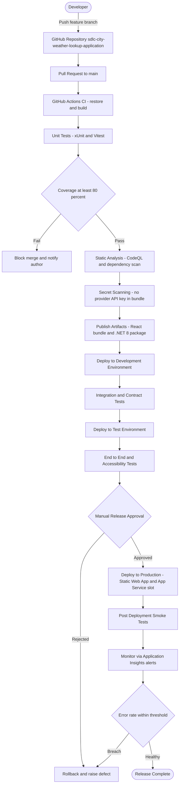
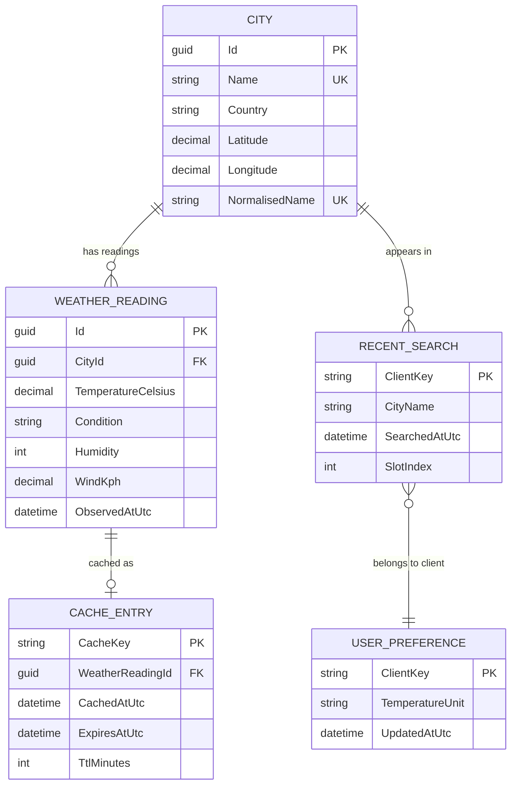
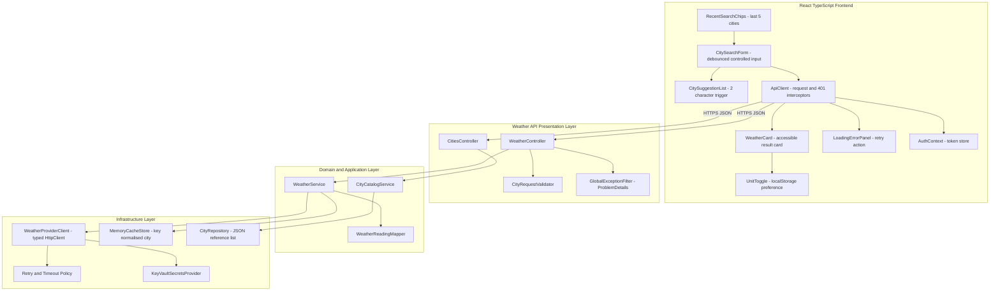
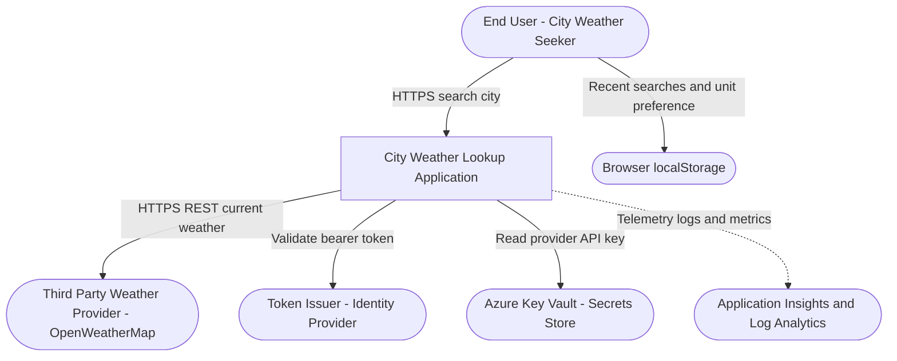

---

# **6. Effort & Schedule Estimation**

## **6.1 Estimation Approach**

Estimation uses a blended approach so that no single technique's blind spot drives the plan. **Story points** (modified Fibonacci: 1, 2, 3, 5, 8, 13) are assigned relative to a reference story - User Story 2334 (`GET /api/weather?city={name}`) is the 5-point anchor because it is well understood and touches controller, service and provider layers. On that scale the backlog estimates to roughly 76 points: Feature 2328 (City Search & Weather Display UI) at 21 points across its four stories, Feature 2333 (Weather API) at 26 points across four stories, Feature 2338 (City & Weather Data Models) at 13 points across three stories, and Feature 2342 (Auth & API Security) at 16 points across three stories.

**T-shirt sizing** is applied at the Feature level for executive communication: Feature 2333 is Large (the provider integration, resilience policy and caching carry the most unknowns), Feature 2328 is Medium-to-Large (four stories but well-bounded React work), Feature 2342 is Medium (standard JWT and rate-limiting patterns, but with mandatory security review), and Feature 2338 is Small-to-Medium (schema definition plus a static JSON reference list).

**Three-point estimates** are applied to the two highest-variance items. Provider integration (User Story 2336): Optimistic 4 days, Realistic 7 days, Pessimistic 13 days, giving a PERT expected value of approximately 7.5 days - the spread reflects uncertainty in vendor payload shape, quota behaviour and error semantics. Security hardening (User Stories 2343, 2344, 2345 combined): Optimistic 6 days, Realistic 10 days, Pessimistic 18 days, PERT expected approximately 10.7 days, with the pessimistic tail driven by identity-provider configuration and any rework arising from security review. The overall 12-week schedule in Section 5.1 carries an approximate 15% buffer against the realistic case.

## **6.2 Timeline & Milestones**

- **M1 - Foundation complete (Week 1 start, Week 2 end).** Azure Development resources provisioned, both application skeletons building, GitHub Actions CI green with the 80% coverage gate armed. Dependency: none - this is the critical-path origin, and every later milestone slips one-for-one if M1 slips.
- **M2 - Data contracts frozen (Week 2 start, Week 3 end).** City and WeatherReading schemas published in OpenAPI and `GET /api/cities` live in Development (User Stories 2339, 2340). Dependency: M1. This is on the critical path because both the provider mapper and the generated TypeScript client target these schemas; freezing them late causes rework in two codebases simultaneously.
- **M3 - Weather API functionally complete (Week 3 start, Week 6 end).** Endpoint, validation, provider resilience and ten-minute caching all delivered with 200/400/404/503 behaviours verified (User Stories 2334, 2335, 2336, 2337). Dependency: M2. This is the longest critical-path segment and holds the largest three-point variance.
- **M4 - Frontend functionally complete (Week 4 start, Week 9 end).** Search, display, state handling, unit toggle, recent searches and suggestions delivered (User Stories 2329, 2330, 2331, 2332, 2341). Dependency: M2 for contracts; runs partly in parallel with M3 against a mocked API, which is what keeps M4 off the critical path despite its size.
- **M5 - Security hardened and signed off (Week 7 start, Week 8 end).** Token interceptor, backend 401/403 enforcement, Key Vault-sourced provider key with a clean bundle secret scan, and 429 with `Retry-After` all verified (User Stories 2343, 2344, 2345). Dependency: M3 and M4 must expose the endpoints and client being hardened; Security engineer sign-off is a hard gate - no Production promotion occurs without it.
- **M6 - Production release and hypercare exit (Week 9 start, Week 12 end).** Full regression in Test, Production slot-swap deploy, seven-day error-rate-within-threshold hypercare, runbooks and key-rotation schedule handed to Operations. Dependency: M5. Critical-path analysis: M1 to M2 to M3 to M5 to M6 is the binding chain at approximately 12 weeks; M4 carries about 2 weeks of float.

---

# **7. Assumptions & Dependencies**

## **7.1 Assumptions**

Epic 2327 states its own assumptions explicitly, and this design adopts them verbatim: a public third-party weather provider (for example OpenWeatherMap) supplies the data; temperature is shown in Celsius with a Fahrenheit toggle; there are no user accounts beyond an API token; and recent searches are stored client-side. Everything below extends those without contradicting them.

We assume the provider offers a current-weather endpoint returning at minimum temperature, a condition description and an observation timestamp, and that it signals an unknown city with a distinguishable not-found response - this is what makes the HTTP 404 branch in User Story 2334 implementable without heuristic string matching. We assume the provider imposes a finite request quota, which is the entire justification for the ten-minute cache and the 60-requests-per-minute rate limit.

We assume an identity provider already exists and issues signed JWT bearer tokens carrying a `weather.read` permission claim; building an identity provider is out of scope and no story requests one. We assume Azure as the hosting platform (Azure Static Web Apps plus Azure App Service Linux on .NET 8), because Epic 2327 names no platform and the governing technology baseline specifies Azure, Key Vault and Application Insights as defaults.

We assume a single geographic region with no multi-region active-active requirement, since no story states a residency or regional-failover need. We assume the supported-city reference list is small enough (order of hundreds to a few thousand entries) to be served from a version-controlled JSON seed rather than a relational database, and that it changes rarely enough to be updated by pull request. We assume in-process `IMemoryCache` is acceptable rather than a distributed cache, accepting that each App Service instance maintains its own cache and that scaling out proportionally reduces the hit ratio - if horizontal scale beyond two instances becomes necessary, the cache should be revisited as a distributed cache, and that is recorded as an open architecture decision.

## **7.2 External Dependencies**

**Third-party weather provider (vendor).** The single most consequential external dependency. Our availability is bounded by theirs for cache-miss traffic; their quota bounds our throughput; their payload shape bounds our mapper. Mitigations in this design are the three-attempt retry with backoff, the ten-minute cache, graceful HTTP 503 degradation, and a mapper isolated in `WeatherReadingMapper` so a provider swap touches one class. The vendor account owner is responsible for the commercial SLA and any quota increase.

**Identity provider / token issuer.** Supplies and signs the bearer tokens validated by the API. Dependency on its published signing-key endpoint being reachable at startup and on key rollover being handled transparently; an outage here makes every request return HTTP 401, so its availability is effectively a hard dependency of the whole application.

**Azure platform services.** Azure Static Web Apps (frontend hosting), Azure App Service Linux .NET 8 (API hosting), Azure Key Vault (provider API key custody, 90-day rotation), Application Insights and Log Analytics (telemetry and availability testing). Platform SLAs apply per service, and the Platform/DevOps team owns the relationship.

**GitHub.** Hosts the repository `sdlc-city-weather-lookup-application`, the architecture artefacts under `docs/architecture/epic-2327/`, and the GitHub Actions pipelines that build, scan and deploy. A GitHub outage blocks delivery but not runtime.

**Azure DevOps.** System of record for Epic 2327, its four Features, fifteen User Stories and all acceptance criteria. Required for traceability reporting and sprint execution; not a runtime dependency.

**Cross-team dependencies.** The Security engineer's review is a release-blocking dependency for Feature 2342; the Platform engineer's deployment approval is a release-blocking dependency for Production; and the Product Owner's story acceptance is required before any story counts as done.

---

# **8. Appendices**

## **8.1 Additional Diagrams**

All Mermaid sources below are committed under `docs/architecture/epic-2327/` in the repository `sdlc-city-weather-lookup-application` and are the authoritative, version-controlled form of every diagram in this document.

- !High-Level Flow

**Caption - High-Level Flow.** The complete end-to-end request flow for Epic 2327, from the user's keystroke through client validation, throttling, token checks, server-side validation and normalisation, cache evaluation, provider call, and finally rendering with unit preference and recent-search persistence. It ties the four Features together into one picture and shows exactly where each HTTP status code originates.

**Fallback (source: `docs/architecture/epic-2327/diagram-highlevel.mmd`):**

- !Deployment Diagram

**Caption - Deployment Diagram.** Where each component physically runs: the React bundle on Azure Static Web Apps, the .NET 8 API on Azure App Service Linux behind its rate limiter, Key Vault holding the provider key accessed by managed identity, and telemetry flowing to Application Insights and Log Analytics. Its business meaning is cost and blast-radius clarity - the only outbound path to the paid provider originates in one compute tier that we control and monitor.

**Fallback (source: `docs/architecture/epic-2327/diagram-deployment.mmd`):**

- !CI/CD Pipeline

**Caption - CI/CD Pipeline.** The delivery path from a developer push through build, unit test, the 80% coverage gate, CodeQL and dependency scanning, the bundle secret scan that enforces User Story 2345, artefact publication, environment promotion, manual production approval, slot-swap deploy, smoke tests and the monitored auto-rollback gate. It matters because the secret scan and the coverage gate are the two automated controls that make security and quality non-negotiable rather than aspirational.

**Fallback (source: `docs/architecture/epic-2327/diagram-cicd.mmd`):**

- !Data Model

**Caption - Data Model.** The entity-relationship view derived directly from User Story 2339 and extended with the cache and client-side persistence entities implied by User Stories 2337, 2341 and 2332. No attribute in this model is personally identifying, which is why Section 4.4 requires no additional at-rest encryption beyond platform defaults.

**Fallback (source: `docs/architecture/epic-2327/diagram-datamodel.mmd`):**

- !Component Diagram

**Caption - Component Diagram.** Internal module dependencies across the React frontend, the API presentation layer, the domain layer and the infrastructure layer. It shows the strict downward dependency direction that keeps `WeatherService` free of HTTP concerns and `WeatherProviderClient` the only class that knows the vendor exists - the structural property that makes a provider change a one-class change.

**Fallback (source: `docs/architecture/epic-2327/diagram-component.mmd`):**

**System Context (source: `docs/architecture/epic-2327/system-context.mmd`).** Shows the application as a single box with its end user, the third-party weather provider, the token issuer, Azure Key Vault, Application Insights and browser `localStorage`.

### **Traceability Matrix**

| Work Item | Type | Title | Priority | Architecture Element |
|---|---|---|---|---|
| 2327 | Epic | City Weather Lookup Application | 2 | Whole solution; repository `sdlc-city-weather-lookup-application` |
| 2328 | Feature | City Search & Weather Display UI | 1 | React 18 TypeScript frontend tier |
| 2329 | User Story | Search for a city by name | 1 | `CitySearchForm`, 300 ms debounce, 2-character minimum |
| 2330 | User Story | Display current temperature for the selected city | 1 | `WeatherCard` with ARIA labelling and keyboard focus order |
| 2331 | User Story | Handle loading and error states in the UI | 2 | `LoadingErrorPanel`; 404 and 5xx branches with Retry |
| 2332 | User Story | Toggle between Celsius and Fahrenheit | 3 | `UnitToggle`; `USER_PREFERENCE` in `localStorage` |
| 2333 | Feature | Weather API (ASP.NET Core Web API) | 1 | .NET 8 Web API application tier |
| 2334 | User Story | GET /api/weather?city={name} endpoint | 1 | `WeatherController`, `WeatherResponseDto`, 200/404 |
| 2335 | User Story | Validate and normalise city input on the backend | 2 | `CityRequestValidator`, 400 `ProblemDetails`, 100-char limit |
| 2336 | User Story | Integrate third-party weather provider with resilience | 2 | `WeatherProviderClient`, 5 s timeout, 3 retries, 503 degrade |
| 2337 | User Story | Cache weather results to limit provider calls | 3 | `MemoryCacheStore`, 10-minute TTL, `CACHE_ENTRY` |
| 2338 | Feature | City & Weather Data Models | 2 | JSON schemas and `CITY` / `WEATHER_READING` entities |
| 2339 | User Story | Define City and WeatherReading JSON data models | 2 | `CITY` and `WEATHER_READING` in the Data Model diagram |
| 2340 | User Story | Provide a supported city reference list | 3 | `CitiesController`, `CityRepository`, `CitySuggestionList` |
| 2341 | User Story | Store and display recent city searches | 4 | `RecentSearchChips`, `RECENT_SEARCH`, 5-entry FIFO |
| 2342 | Feature | Auth & API Security | 2 | Security edge: rate limiter, authentication, authorization |
| 2343 | User Story | Attach auth token to API requests from React | 2 | `ApiClient` bearer interceptor, 401 clears token |
| 2344 | User Story | Enforce token validation on weather endpoints | 2 | JWT bearer middleware; 401 and 403 separation |
| 2345 | User Story | Protect the provider API key and rate-limit clients | 2 | `KeyVaultSecretsProvider`; 60 req/min, 429 `Retry-After` |

### **Glossary**

- **ADR (Architecture Decision Record)** - a short, dated record of one significant design decision and its rationale.
- **DTO (Data Transfer Object)** - a flat object shaped for transport across the API boundary, such as `WeatherResponseDto`.
- **JWT (JSON Web Token)** - the signed bearer-token format validated by the API for authentication.
- **PII (Personally Identifiable Information)** - none is stored by this solution; city names and unit preferences are not identifying.
- **ProblemDetails** - the RFC 7807 machine-readable error body returned on HTTP 400 validation failures.
- **RBAC (Role-Based Access Control)** - the Azure and repository permission model described in Section 5.2.
- **RTO / RPO (Recovery Time / Point Objective)** - 1 hour and effectively 0 respectively, per Section 4.3.
- **SPA (Single-Page Application)** - the React frontend delivery model.
- **TTL (Time To Live)** - the 10-minute absolute expiry on each weather cache entry.
