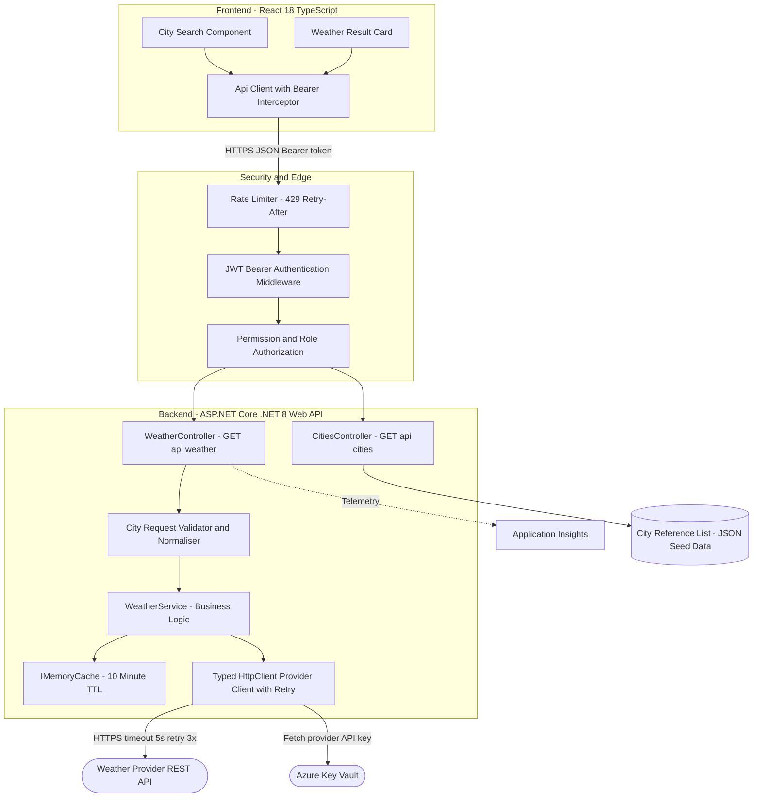
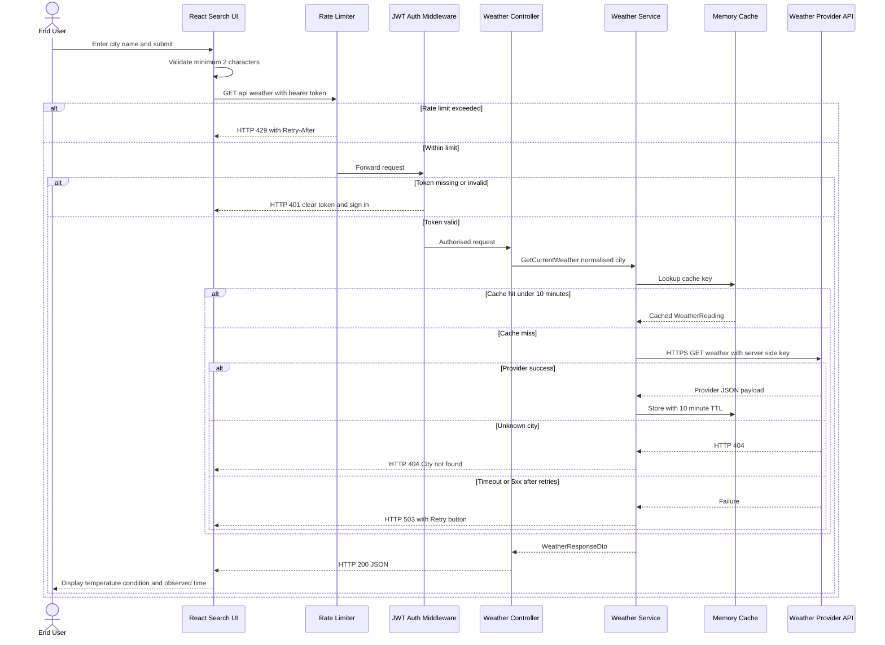
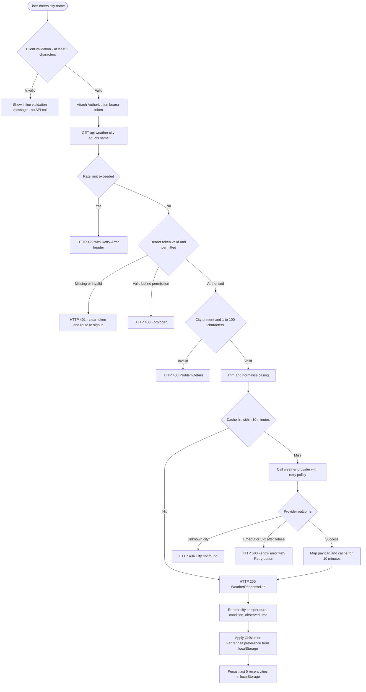
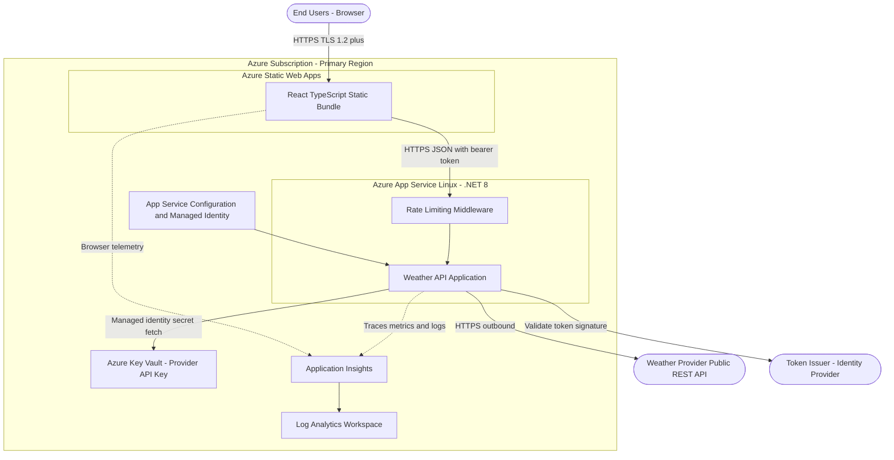
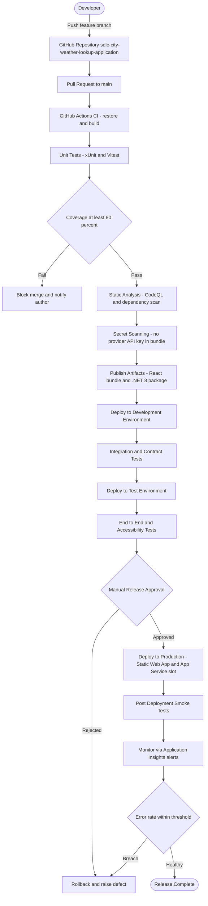
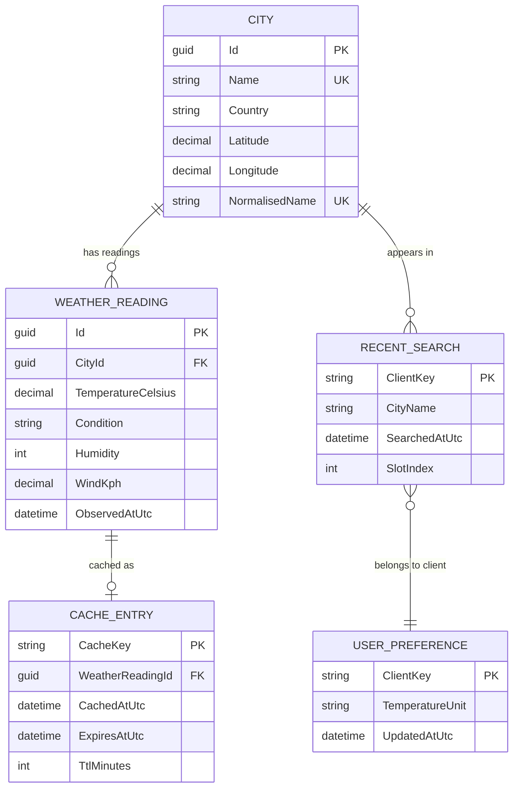
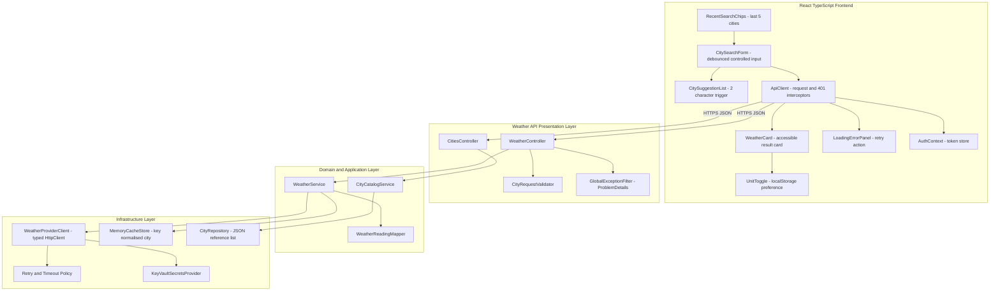
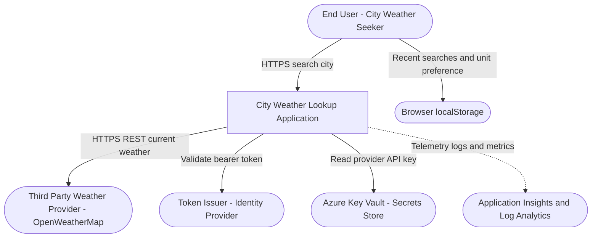

# **1. Introduction**

## **1.1 Purpose**

Users today have no lightweight, trustworthy way inside our estate to look up the current temperature for a named city without visiting an external consumer weather site. The City Weather Lookup Application (Azure DevOps Epic 2327) closes that gap by delivering a small, secure, token-protected web application where a user types a city name and immediately sees its current temperature, weather condition and observation time.

The solution is scoped as a React (TypeScript) single-page frontend backed by an ASP.NET Core (.NET 8) Web API that brokers all calls to a third-party weather provider (assumed OpenWeatherMap). The backend exists specifically so that the provider API key never leaves server-side configuration, so that city input is validated and normalised consistently, and so that provider quota is protected by server-side caching and per-client rate limiting. Business Impact & Key Decisions: brokering through our own API rather than calling the provider directly from the browser is the single most important decision in this design - it is what makes User Story 2345 ("no key present in client code or network responses") achievable, and it is what allows the ten-minute cache in User Story 2337 to cut provider quota consumption across all users rather than per browser.

## **1.2 Scope**

**Functional Scope**: City search with client-side and server-side validation (User Stories 2329, 2335), current-temperature display with condition and last-updated time (User Story 2330), loading/404/5xx state handling with retry (User Story 2331), Celsius-Fahrenheit toggle persisted in localStorage (User Story 2332), `GET /api/weather?city={name}` returning a WeatherResponseDto (User Story 2334), resilient third-party provider integration (User Story 2336), ten-minute in-memory caching keyed by normalised city (User Story 2337), City and WeatherReading JSON schemas (User Story 2339), a backend-served supported-city reference list exposed via `GET /api/cities` with two-character suggestion triggering (User Story 2340), and client-side recent-search chips limited to the last five cities (User Story 2341).

**Non-Functional Scope**: Token-based authentication attached by a React HTTP interceptor with 401-driven token clearing and sign-in redirect (User Story 2343); backend bearer-token validation returning HTTP 401 for missing/invalid tokens and HTTP 403 for valid tokens lacking the required permission (User Story 2344); provider API key held only in server-side secrets, with per-client rate limiting returning HTTP 429 plus a `Retry-After` header (User Story 2345); HTTPS-only transport; accessibility of the result card to keyboard and screen-reader users (User Story 2330); and structured observability through Application Insights and Log Analytics.

**In-Scope Integrations**: The third-party weather provider REST API (assumed OpenWeatherMap) accessed over HTTPS with a server-held key; the token issuer / identity provider whose signed bearer tokens the API validates; Azure Key Vault as the secrets store for the provider API key; and Application Insights with a Log Analytics workspace as the telemetry sink. Browser `localStorage` is treated as an in-scope client-side persistence surface for the unit preference and recent searches, because Epic 2327 explicitly states recent searches are stored client-side.

**Out-of-Scope Items**: There are no user accounts, registration, profile management or password flows - Epic 2327 states explicitly that there is no user identity beyond an API token, so user administration screens are excluded. Native mobile applications are excluded; the React SPA is responsive but browser-delivered. Weather forecasting (multi-day outlook), historical weather analytics, severe-weather alerting, geolocation-based auto-detection, and map or radar visualisation are all excluded because no Feature or User Story under Epic 2327 requires them. A relational database for weather history is also excluded: the only persistent server-side data is the static city reference list, and weather readings live only in the short-lived cache.

**Assumptions & Constraints**: A public third-party weather provider supplies all weather data and is subject to its own vendor quota and availability; our design assumes a free-or-standard tier with a finite request quota, which is precisely why caching and rate limiting are mandatory rather than optional. Temperature is sourced and stored in Celsius, with Fahrenheit derived client-side by conversion so the API contract stays single-unit. The identity provider that issues bearer tokens is assumed to already exist and is consumed, not built. Hosting is assumed to be Azure (Azure Static Web Apps plus Azure App Service) consistent with the governance default technology stack, since Epic 2327 does not name a hosting platform.

## **1.3 Methodology**

Delivery follows an Agile Scrum approach with two-week sprints, driven directly by the Azure DevOps backlog rooted at Epic 2327 and decomposed into four Features (2328 City Search & Weather Display UI, 2333 Weather API, 2338 City & Weather Data Models, 2342 Auth & API Security) and fifteen User Stories. Each User Story carries Given/When/Then acceptance criteria that are used verbatim as the basis for automated test cases, so acceptance criteria act as the contract between the Business Analyst, Architect, Developer and QA roles.

Design review is performed as a single architecture review of this System Design Document before the first implementation sprint, followed by lightweight per-story design confirmation during sprint planning. Significant decisions - brokering the provider through our own API, caching in process memory rather than a distributed cache, serving the city list from a JSON seed rather than a database, and converting units client-side - are recorded as Architecture Decision Records alongside this document in the same repository so that the rationale survives beyond the delivery team.

Tooling: Azure DevOps is the system of record for requirements and traceability; GitHub (`sdlc-city-weather-lookup-application`) is the system of record for architecture artefacts, Mermaid diagram sources, this document and all future source code; Mermaid is used as the diagram-as-code notation so diagrams are version-controlled and reviewable in pull requests; and GitHub Actions is the automation backbone for build, test, scan and deploy.

---

# **2. System Architecture**

## **2.1 Software Architecture**

The solution is a classic three-tier layered architecture with a strict dependency direction: presentation depends on application, application depends on infrastructure, and nothing depends back upwards. The presentation tier is a React 18 TypeScript single-page application composed of a debounced `CitySearchForm`, a `CitySuggestionList` that activates at two typed characters, an accessible `WeatherCard`, a `UnitToggle`, `RecentSearchChips`, and a `LoadingErrorPanel` that renders pending, not-found and failure states with a retry action. All outbound traffic passes through a single `ApiClient` that owns the bearer-token request interceptor and the 401 response interceptor.

The application tier is an ASP.NET Core (.NET 8) Web API exposing exactly two endpoints - `GET /api/weather?city={name}` and `GET /api/cities` - both protected by the same middleware pipeline. A request first meets the rate limiter, then JWT bearer authentication, then permission-based authorization, and only then reaches `WeatherController` or `CitiesController`. `WeatherController` delegates to `CityRequestValidator` for trimming, length bounds and allowed-character checks before `WeatherService` executes business logic. `WeatherService` consults `IMemoryCache` first and only calls `WeatherProviderClient` - a typed `HttpClient` wrapped in a retry-and-timeout policy - on a cache miss.

Interfaces and protocols are deliberately narrow: browser-to-API is HTTPS with JSON payloads and an `Authorization` bearer header; API-to-provider is outbound HTTPS with the key injected from Azure Key Vault via managed identity; API-to-telemetry is the Application Insights SDK over HTTPS. Error semantics are uniform and contract-level: HTTP 400 with a `ProblemDetails` body for validation failures, 401 for missing or invalid tokens, 403 for insufficient permission, 404 for an unknown city, 429 with a `Retry-After` header for throttling, and 503 when the provider remains unavailable after retries.

### **Diagram: Solution Architecture**

**Caption.** This diagram shows how a city search travels from the React frontend, through the security edge (rate limiter, JWT authentication, permission authorization), into the Weather API's controller/validator/service layering, out to the cache or the external weather provider, and finally into Application Insights for telemetry. Its business meaning is containment of risk: the provider key and the provider quota both sit behind our own boundary, so a change of provider, a quota breach, or a provider outage is absorbed by our API rather than reaching the user's browser. Source: `docs/architecture/epic-2327/diagram-architecture.mmd`.

**Textual description.** Six logical groupings exist: Frontend (React components and the single API client), Security Edge (rate limiting, authentication, authorization), Backend (controllers, validator, service, provider client, cache), Data (the JSON city reference list), External (weather provider, Key Vault) and Observability (Application Insights feeding Log Analytics). Every arrow is labelled with its protocol or action, and the only path from the browser to the provider runs through the full security edge.

---

# **3. Detailed Design**

## **3.1 Software Detailed Design**

**Module breakdown.** Frontend: `CitySearchForm` (controlled input, 300 ms debounce, blocks submit below two characters per User Story 2329), `CitySuggestionList` (filters the `/api/cities` payload once two characters are typed, per User Story 2340), `WeatherCard` (renders city name, temperature, condition text and last-updated time with ARIA labelling and full keyboard focus order, per User Story 2330), `UnitToggle` (pure conversion `F = C x 9/5 + 32`, preference written to `localStorage`, per User Story 2332), `RecentSearchChips` (FIFO list capped at five entries in `localStorage`, per User Story 2341), `LoadingErrorPanel` (disables submit while a request is in flight, renders "City not found" on 404 and an error message with a Retry button on 5xx, per User Story 2331), `AuthContext` (token store) and `ApiClient` (interceptors, per User Story 2343).

**Backend classes.** `WeatherController` exposes `GET /api/weather?city={name}` and returns `WeatherResponseDto { city, temperatureCelsius, condition, observedAtUtc }`. `CitiesController` exposes `GET /api/cities` returning an array of `{ id, name, country }`. `CityRequestValidator` enforces: not null, not empty, maximum 100 characters, trims surrounding whitespace and normalises casing before lookup (User Story 2335). `WeatherService` orchestrates cache-then-provider resolution. `WeatherReadingMapper` maps the provider payload onto the internal `WeatherReading` model. `WeatherProviderClient` is a typed `HttpClient` registered with a 5-second timeout and a three-attempt exponential-backoff retry policy (User Story 2336). `GlobalExceptionFilter` converts unhandled exceptions into RFC 7807 `ProblemDetails` so no stack trace reaches a client.

**Key algorithms.** Cache key derivation is `weather:{normalisedCityName}` where normalisation is trim plus invariant lower-casing - this guarantees that "london", " London " and "LONDON" all resolve to one cache entry, which is what makes the ten-minute TTL in User Story 2337 effective rather than cosmetic. Cache lookup precedes every provider call; on a hit within ten minutes the provider is not contacted at all. On a miss, the provider is called, the response is mapped, the entry is written with a ten-minute absolute expiry, and the mapped reading is returned.

**Error handling, idempotency, retries and caching.** Both endpoints are HTTP GET and therefore naturally idempotent and safe to retry; the client Retry button simply re-issues the same request. Retry on the provider edge is bounded at three attempts with exponential backoff and is applied only to timeouts and 5xx responses - a provider 404 is a business outcome (unknown city) and is never retried, it is translated straight to HTTP 404 for the client. When retries are exhausted the API degrades gracefully to HTTP 503 rather than hanging, satisfying User Story 2336. Cache invalidation is purely time-based; there is no manual purge path because weather data is inherently time-decaying and a ten-minute staleness window is acceptable for a current-temperature display.

### **Diagram: Critical Workflow Sequence**

**Caption.** This diagram traces the single highest-value flow in Epic 2327 - a user searching for a city and receiving its current temperature - including the throttling, authentication, validation, cache-hit, cache-miss, unknown-city and provider-failure branches. It matters commercially because every branch shown maps to an acceptance criterion that QA will test, so the diagram doubles as the test-scenario inventory. Source: `docs/architecture/epic-2327/diagram-sequence.mmd`.

**Textual description.** The happy path is eight hops: user submits, client validates length, request passes the rate limiter and token validation, the controller validates and normalises the city, the service checks cache, returns on hit or calls the provider on miss, caches the result, and the UI renders the card and persists the recent search. Four failure branches short-circuit that path: 429 throttling, 401 unauthorised, 404 unknown city and 503 provider unavailable.

---

---

# **4. Technical Design Specification**

## **4.1 Integration Plan**

- **Third-party weather provider dependency (User Story 2336).** The Weather API integrates with one external provider (assumed OpenWeatherMap current-weather endpoint) over outbound HTTPS using a typed `HttpClient` named `WeatherProviderClient`, configured with a 5-second per-attempt timeout and a 3-attempt exponential-backoff retry on timeouts and 5xx only. Ownership sits with the Backend team; the integration checkpoint is a recorded contract test proving the provider payload maps cleanly onto the internal `WeatherReading` model.
- **Internal API data contract (User Stories 2334, 2339).** The frontend consumes exactly two contracts: `GET /api/weather?city={name}` returning `WeatherResponseDto { city: string, temperatureCelsius: decimal, condition: string, observedAtUtc: datetime }`, and `GET /api/cities` returning `City[] { id: guid, name: string, country: string }`. These are published as an OpenAPI 3.0 document generated by Swashbuckle at `/swagger/v1/swagger.json`; the checkpoint is that the generated TypeScript client compiles against the React app with zero `any` types.
- **Authentication interface (User Stories 2343, 2344).** The React `ApiClient` attaches `Authorization: Bearer <token>` to every backend call from `AuthContext`, and the API validates the token signature, issuer, audience and expiry via JWT bearer middleware against the identity provider's published signing keys. The measurable checkpoint is an automated test proving an unauthenticated call to `/api/weather` returns HTTP 401 and a token lacking the required permission claim returns HTTP 403.
- **Secrets interface (User Story 2345).** The provider API key is read at startup from Azure Key Vault through the App Service system-assigned managed identity and is never written to source control, app settings in plain text, client bundles or response bodies. The checkpoint is an automated build-time secret scan over the published React bundle that fails the pipeline if any string matching the provider key pattern is found.
- **Event and telemetry flow.** All request, dependency, exception and custom cache-hit/cache-miss events are emitted to Application Insights and retained in the Log Analytics workspace, giving a measurable cache-hit-ratio metric. Integration is considered complete when a single end-to-end search produces one request telemetry item, at most one provider dependency item, and one cache-outcome custom event correlated by the same operation ID.

## **4.2 Configuration Checklist**

- **Provider settings.** `WeatherProvider:BaseUrl`, `WeatherProvider:ApiKeySecretName` (Key Vault secret reference, never the literal key), `WeatherProvider:TimeoutSeconds = 5`, `WeatherProvider:RetryCount = 3`, `WeatherProvider:Units = metric`. These are bound to a strongly typed `WeatherProviderOptions` class validated with `ValidateDataAnnotations().ValidateOnStart()` so a misconfiguration fails fast at boot rather than silently at first request.
- **Cache settings (User Story 2337).** `Cache:WeatherTtlMinutes = 10`, `Cache:SizeLimitEntries = 1000`, `Cache:KeyPrefix = weather:`. The ten-minute value is taken directly from the acceptance criterion and must be configurable per environment so that load tests can shorten it; the size limit protects App Service memory on the assumed Basic/Standard tier.
- **Security settings (User Stories 2344, 2345).** `Auth:Authority`, `Auth:Audience`, `Auth:RequiredPermission = weather.read`, `RateLimit:PermitLimit = 60`, `RateLimit:WindowSeconds = 60`, `RateLimit:QueueLimit = 0`, and `RateLimit:RetryAfterSeconds = 60` which populates the mandatory `Retry-After` header on HTTP 429 responses.
- **Frontend settings.** `VITE_API_BASE_URL` per environment, `VITE_SEARCH_DEBOUNCE_MS = 300`, `VITE_MIN_SEARCH_CHARS = 2` (enforcing User Story 2329), `VITE_SUGGESTION_MIN_CHARS = 2` (User Story 2340), `VITE_RECENT_SEARCH_LIMIT = 5` (User Story 2341) and `VITE_DEFAULT_UNIT = celsius` (User Story 2332). All are build-time variables; none may hold a secret, by design.
- **Platform and version control.** Named Azure resources are `swa-cityweather-<env>` (Azure Static Web Apps), `app-cityweather-api-<env>` (Azure App Service Linux, .NET 8 runtime), `kv-cityweather-<env>` (Key Vault), `appi-cityweather-<env>` (Application Insights) and `log-cityweather-<env>` (Log Analytics). Every one of these is defined as infrastructure-as-code in the same repository and promoted through environments by pipeline variable groups, so no portal-only configuration exists.

## **4.3 Service Level Agreement**

- **Latency.** The `GET /api/weather` endpoint must return in under 400 ms at the 95th percentile on a cache hit and under 2,000 ms at the 95th percentile on a cache miss that requires a provider round trip. The provider call itself is capped at 5 seconds per attempt, bounding worst-case latency at roughly 15 seconds across three attempts before the 503 degradation path fires.
- **Availability.** The application targets 99.5% monthly uptime for its own components, measured by an Application Insights availability test hitting a `/health` endpoint every five minutes from two regions. Provider-caused unavailability is tracked separately because the vendor's own SLA is outside our control; the ten-minute cache means a short provider outage is invisible to users already served for a given city.
- **RTO and RPO.** Recovery Time Objective is 1 hour, achieved by redeploying the last known-good artefact to the App Service staging slot and swapping. Recovery Point Objective is effectively 0 for business data, because the only persistent server-side asset is the version-controlled city reference list - weather readings are disposable cache entries and recent searches live in each user's own browser.
- **Maintenance and change windows.** Planned releases occur inside a weekly window with zero expected downtime via slot swap; any change requiring real downtime is restricted to a monthly window with 48 hours' advance notice. Cache warm-up after a restart is accepted as a brief period of elevated provider calls and is monitored rather than prevented.
- **Escalation and quota guarantees.** Severity 1 (service unreachable) is acknowledged within 30 minutes and escalated to the Backend lead within 1 hour; Severity 2 (provider degraded, 503 rate above 5% for 15 minutes) within 4 business hours. Rate limiting is guaranteed at 60 requests per client per 60-second window, and any HTTP 429 must carry a `Retry-After` header so clients can back off deterministically (User Story 2345).

## **4.4 Security & Compliance Architecture**

- **Transport and segmentation.** All traffic is HTTPS with TLS 1.2 or higher; HTTP is redirected and HSTS is enabled. The React bundle is served from Azure Static Web Apps and can reach only the Weather API origin permitted by a strict CORS policy listing exact environment origins - wildcard CORS is prohibited because it would let any site replay a user's bearer token against our API.
- **Authentication and authorization (User Stories 2343, 2344).** JWT bearer tokens are validated for signature, issuer, audience, expiry and not-before. Authorization is permission-based: the `weather.read` claim is required for `/api/weather` and `/api/cities`. Missing or invalid token yields HTTP 401; a valid token without the permission yields HTTP 403 - the two are deliberately distinguished so the frontend can clear the token only on 401 and avoid a pointless sign-in loop on 403.
- **Secrets management and key rotation (User Story 2345).** The provider API key lives only in Azure Key Vault, retrieved via managed identity, with no key material in source, client bundles, logs or responses. Rotation is quarterly (every 90 days) and on-demand after any suspected exposure; the application reads the secret through a cached secret client with a 24-hour refresh so a rotated key is picked up without redeployment.
- **Encryption and data protection.** Data in transit is TLS 1.2+ end to end, including the outbound provider call. There is no server-side data at rest beyond the public city reference list, which contains no personal data; Key Vault secrets are encrypted at rest with platform-managed keys. Browser `localStorage` holds only a unit preference and up to five city names, which are not personal identifiers, so no additional client-side encryption is warranted.
- **Logging, audit and abuse controls.** Authentication failures, authorization denials and rate-limit rejections are logged with correlation IDs but never with token values, and the provider key is added to the telemetry redaction list. Per-client rate limiting at 60 requests per minute is the primary abuse control protecting both our App Service and the vendor quota; sustained 429 activity raises an alert for investigation.

## **4.5 Workflow, Orchestration & Scheduling**

- **Primary request workflow.** The orchestration for every search is strictly ordered: rate limit, authenticate, authorize, validate and normalise, cache lookup, provider call on miss, map, cache write, respond. This ordering is deliberate and measurable - rejecting throttled and unauthenticated traffic before any validation or provider work means abusive load costs us almost nothing in provider quota.
- **Resilience policy (User Story 2336).** The provider call is wrapped in a 5-second timeout and three exponential-backoff retries (roughly 1 s, 2 s, 4 s) applied only to transient failures. A provider 404 is classified as terminal and non-retryable; exhausted retries produce HTTP 503 with a user-facing retry affordance rather than an unbounded wait.
- **Caching schedule (User Story 2337).** Cache entries carry a ten-minute absolute expiry keyed by normalised city name. There is no background refresh job: expiry is lazy, so the first request after expiry pays the provider round trip. This keeps the architecture free of any scheduler or background worker, which is a conscious simplification given the application's small footprint.
- **Client-side workflows.** The debounced search (300 ms) prevents a provider-bound request per keystroke; suggestions activate at two characters; the recent-search list is updated after every successful fetch using a five-entry FIFO policy; and the unit preference is applied at render time from `localStorage` so a page reload preserves the user's last choice (User Stories 2329, 2332, 2340, 2341).
- **Failure-handling paths.** Each failure mode has one defined terminal behaviour and no silent fallback: 400 renders inline validation detail from the `ProblemDetails` body, 401 clears the token and routes to sign-in, 403 renders a permission message without clearing the token, 404 renders "City not found", 429 renders a throttling message honouring `Retry-After`, and 503 renders an error message with a Retry button.

## **4.6 Release Management & Environment Strategy**

- **Branching strategy.** Trunk-based development on `main` with short-lived `feature/<work-item-id>-<slug>` branches named after the Azure DevOps User Story ID, so every branch is traceable to a backlog item. Direct pushes to `main` are blocked by branch protection; all changes land through pull request.
- **Pipelines.** GitHub Actions in the `sdlc-city-weather-lookup-application` repository runs restore, build, unit test, coverage gate, CodeQL and dependency scan, secret scan and artefact publish on every pull request, and the deployment stages on merge to `main`. The React bundle and the .NET 8 package are published as separately versioned artefacts so a frontend-only fix does not force a backend redeploy.
- **Environment promotion.** Three environments - Development, Test and Production - are promoted strictly in order with the same artefact, never a rebuild. Development deploys automatically on merge; Test requires green integration and contract tests; Production requires a manual release approval recorded against the release.
- **Artefact versioning.** Semantic versioning `MAJOR.MINOR.PATCH` with the build number and commit SHA embedded in the artefact and surfaced on the `/health` endpoint, so the exact deployed commit is verifiable in any environment without guesswork.
- **Rollback.** Production deploys to an App Service staging slot, is smoke-tested, then slot-swapped; rollback is an immediate reverse swap targeting under 5 minutes. A breach of the post-deployment error-rate threshold triggers automatic rollback and raises a defect against the originating User Story.

## **4.7 Testing Strategy & Quality Gates**

- **Test stages.** Unit tests (xUnit for the .NET API, Vitest plus React Testing Library for the frontend) run on every pull request; integration tests exercise the controller pipeline with a stubbed provider; contract tests validate the OpenAPI document against the generated client; end-to-end tests drive a real browser through the search flow in the Test environment.
- **Coverage thresholds.** A minimum 80% line coverage gate is enforced on both the API and the frontend, with 100% branch coverage required specifically on `CityRequestValidator`, `WeatherService` cache logic and the provider retry policy, because those three units encode the acceptance criteria of User Stories 2335, 2337 and 2336.
- **Acceptance-criteria mapping.** Every Given/When/Then criterion in the fifteen User Stories becomes at least one automated test - including the negative paths: empty or sub-two-character input blocked client-side with no API call (2329), 400 `ProblemDetails` on missing/over-100-character city (2335), 404 unknown city (2334), 401 without token and 403 without permission (2344), and 429 with `Retry-After` on rate-limit breach (2345).
- **Accessibility and performance gates.** The result card is tested for keyboard focus order and screen-reader labelling with automated axe-core checks plus one manual screen-reader pass, satisfying User Story 2330. Performance gates assert the 400 ms p95 cache-hit and 2,000 ms p95 cache-miss targets under a 60-requests-per-minute-per-client load profile matching the configured rate limit.
- **Defect severity and environment readiness.** Severity 1 (search unusable, token handling broken, provider key exposed) blocks release outright; Severity 2 (a failure branch rendering the wrong message) blocks promotion to Production but not to Test; Severity 3 and 4 are scheduled. An environment is release-ready only when its configuration validation passes at startup, the health endpoint reports the expected version, and the Key Vault secret resolves successfully.

---

---

# **5. Implementation Plan**

## **5.1 Phased Rollout Strategy**

- **Week 1-2: Foundation and environment setup.** Provision `swa-cityweather-dev`, `app-cityweather-api-dev`, `kv-cityweather-dev`, `appi-cityweather-dev` and `log-cityweather-dev` as infrastructure-as-code; scaffold the React 18 TypeScript SPA and the ASP.NET Core .NET 8 Web API solution; wire the GitHub Actions CI workflow with build, unit test and CodeQL stages. Advancement criterion: a trivial `/health` endpoint deploys automatically to Development on merge and returns the correct commit SHA.
- **Week 2-3: Data models and city reference list (Feature 2338).** Implement the `City` and `WeatherReading` schemas exactly as specified in User Story 2339 (City: id, name, country, latitude, longitude; WeatherReading: cityId, temperatureCelsius, condition, humidity, windKph, observedAtUtc), with nullable/optional fields explicitly documented, and ship `GET /api/cities` serving the JSON reference list (User Story 2340). Advancement criterion: the published OpenAPI document matches the documented schemas field-for-field and type-for-type.
- **Week 3-5: Weather API core (Feature 2333).** Deliver `GET /api/weather?city={name}` returning `WeatherResponseDto` with HTTP 200 and HTTP 404 for unknown cities (User Story 2334), backend validation and normalisation returning `ProblemDetails` on HTTP 400 (User Story 2335), and the typed provider client with 5-second timeout and three-attempt retry degrading to HTTP 503 (User Story 2336). Dependency: Week 2-3 data models must be frozen first, because the mapper targets them.
- **Week 5-6: Caching and quota protection (User Story 2337).** Add `IMemoryCache` with the ten-minute TTL keyed by normalised city name, plus cache-hit/cache-miss custom telemetry. Advancement criterion: a measured cache-hit ratio above 60% under the end-to-end test profile, demonstrating real provider-quota reduction rather than a nominally present cache.
- **Week 4-7: Frontend search and display (Feature 2328, runs in parallel from Week 4).** Build `CitySearchForm` with the two-character minimum and inline validation (User Story 2329), the accessible `WeatherCard` showing city, Celsius temperature, condition and last-updated time (User Story 2330), and the loading/404/5xx state handling with a Retry button (User Story 2331). Gate: the frontend consumes only the generated typed client, never hand-written fetch calls.
- **Week 7-8: Security hardening (Feature 2342).** Implement the React bearer-token interceptor with 401-driven token clearing and sign-in redirect (User Story 2343), backend token validation returning 401/403 (User Story 2344), Key Vault-sourced provider key with the build-time bundle secret scan, and per-client rate limiting returning 429 with `Retry-After` (User Story 2345). Advancement criterion: the secret scan over the production React bundle finds zero provider-key matches.
- **Week 8-9: Secondary UX features.** Deliver the Celsius-Fahrenheit toggle persisted in `localStorage` (User Story 2332), the five-entry recent-search chips (User Story 2341), and city suggestions triggered at two characters (User Story 2340 frontend half). These are deliberately last because they are Priority 3 and 4 items and must not displace security or core-flow work.
- **Week 9-10: Test environment promotion and full regression.** Promote the identical artefact to Test, run integration, contract, end-to-end, accessibility and performance suites, and validate the 400 ms p95 cache-hit and 2,000 ms p95 cache-miss targets. Gate: zero open Severity 1 or Severity 2 defects and 80%+ coverage on both codebases.
- **Week 10-11: Production release and hypercare.** Deploy to the Production App Service staging slot, run smoke tests, slot-swap, and monitor Application Insights alerts for error rate, 503 rate and 429 rate across a one-week hypercare period with the automatic rollback gate armed. Advancement criterion: error rate within threshold for seven consecutive days.
- **Week 11-12: Stabilisation and handover.** Close out defects, finalise runbooks for provider outage and key rotation, confirm the quarterly 90-day key-rotation schedule is calendarised with a named owner, and hand operational ownership to the Platform/Operations team with the observability dashboards in place.

## **5.2 Teams and Security Roles**

- **Frontend team (2 engineers).** Owns the React 18 TypeScript SPA, the `ApiClient` interceptors, accessibility conformance of the result card, and all `localStorage` usage. RBAC scope: write access to the repository frontend paths, Reader on Azure Static Web Apps, no access to Key Vault - the frontend team never needs the provider key, and withholding it is the structural control behind User Story 2345.
- **Backend team (2 engineers).** Owns the ASP.NET Core .NET 8 Web API, validation, caching, the provider client and resilience policy, and the OpenAPI contract. RBAC scope: write access to the repository API paths, Contributor on the App Service, and Key Vault Secrets User (read-only) on the Development vault only; Test and Production secret access is brokered by managed identity, not by humans.
- **Security engineer (shared, 0.3 FTE).** Owns token validation configuration, the permission model (`weather.read`), the CORS allow-list, the rate-limit thresholds, secret-scanning rules and the 90-day key-rotation schedule. Approval authority: a mandatory reviewer on any pull request touching authentication, authorization, CORS or secrets configuration.
- **Platform / DevOps engineer (shared, 0.3 FTE).** Owns infrastructure-as-code, the GitHub Actions pipelines, environment variable groups, slot-swap deployment, rollback automation and the Application Insights / Log Analytics configuration. RBAC scope: Owner on Development and Test resource groups, Contributor plus deployment-approver rights on Production.
- **QA engineer (1 FTE).** Owns translating all Given/When/Then acceptance criteria from the fifteen User Stories into automated tests, the coverage and accessibility gates, defect triage and severity assignment. Authority: can block promotion from Test to Production on any open Severity 1 or Severity 2 defect.
- **Product Owner / Business Analyst.** Owns Epic 2327 and its backlog, acceptance of completed stories, and prioritisation decisions - including the standing decision that Priority 1 stories (2329, 2330, 2334) and all Priority 2 security stories ship before Priority 3 and 4 convenience features.
- **Architect.** Owns this System Design Document, the Mermaid diagram sources in `docs/architecture/epic-2327/`, the Architecture Decision Records, and sign-off on any deviation from the layered design - particularly any proposal to call the weather provider directly from the browser, which is explicitly disallowed.
- **Escalation path.** Severity 1 incidents escalate from the on-call Platform engineer to the Backend lead within 1 hour and to the Product Owner within 4 hours. Provider-side degradation escalates to the vendor account owner, who is the only role authorised to raise a quota increase or vendor support ticket.
- **Separation of duties.** No single individual both writes production secrets and approves production deployments: the Security engineer owns secret material while the Platform engineer owns the deployment approval, which keeps key custody and release authority in different hands.
- **Ownership of platforms.** GitHub repository `sdlc-city-weather-lookup-application` is owned by the Architect with the Platform engineer as administrator; Azure DevOps Epic 2327 and its hierarchy are owned by the Product Owner; Azure subscription resources are owned by the Platform team under the shared naming convention `*-cityweather-<env>`.

---

---

# **6. Effort & Schedule Estimation**

## **6.1 Estimation Approach**

Estimation uses a blended approach so that no single technique's blind spot drives the plan. **Story points** (modified Fibonacci: 1, 2, 3, 5, 8, 13) are assigned relative to a reference story - User Story 2334 (`GET /api/weather?city={name}`) is the 5-point anchor because it is well understood and touches controller, service and provider layers. On that scale the backlog estimates to roughly 76 points: Feature 2328 (City Search & Weather Display UI) at 21 points across its four stories, Feature 2333 (Weather API) at 26 points across four stories, Feature 2338 (City & Weather Data Models) at 13 points across three stories, and Feature 2342 (Auth & API Security) at 16 points across three stories.

**T-shirt sizing** is applied at the Feature level for executive communication: Feature 2333 is Large (the provider integration, resilience policy and caching carry the most unknowns), Feature 2328 is Medium-to-Large (four stories but well-bounded React work), Feature 2342 is Medium (standard JWT and rate-limiting patterns, but with mandatory security review), and Feature 2338 is Small-to-Medium (schema definition plus a static JSON reference list).

**Three-point estimates** are applied to the two highest-variance items. Provider integration (User Story 2336): Optimistic 4 days, Realistic 7 days, Pessimistic 13 days, giving a PERT expected value of approximately 7.5 days - the spread reflects uncertainty in vendor payload shape, quota behaviour and error semantics. Security hardening (User Stories 2343, 2344, 2345 combined): Optimistic 6 days, Realistic 10 days, Pessimistic 18 days, PERT expected approximately 10.7 days, with the pessimistic tail driven by identity-provider configuration and any rework arising from security review. The overall 12-week schedule in Section 5.1 carries an approximate 15% buffer against the realistic case.

## **6.2 Timeline & Milestones**

- **M1 - Foundation complete (Week 1 start, Week 2 end).** Azure Development resources provisioned, both application skeletons building, GitHub Actions CI green with the 80% coverage gate armed. Dependency: none - this is the critical-path origin, and every later milestone slips one-for-one if M1 slips.
- **M2 - Data contracts frozen (Week 2 start, Week 3 end).** City and WeatherReading schemas published in OpenAPI and `GET /api/cities` live in Development (User Stories 2339, 2340). Dependency: M1. This is on the critical path because both the provider mapper and the generated TypeScript client target these schemas; freezing them late causes rework in two codebases simultaneously.
- **M3 - Weather API functionally complete (Week 3 start, Week 6 end).** Endpoint, validation, provider resilience and ten-minute caching all delivered with 200/400/404/503 behaviours verified (User Stories 2334, 2335, 2336, 2337). Dependency: M2. This is the longest critical-path segment and holds the largest three-point variance.
- **M4 - Frontend functionally complete (Week 4 start, Week 9 end).** Search, display, state handling, unit toggle, recent searches and suggestions delivered (User Stories 2329, 2330, 2331, 2332, 2341). Dependency: M2 for contracts; runs partly in parallel with M3 against a mocked API, which is what keeps M4 off the critical path despite its size.
- **M5 - Security hardened and signed off (Week 7 start, Week 8 end).** Token interceptor, backend 401/403 enforcement, Key Vault-sourced provider key with a clean bundle secret scan, and 429 with `Retry-After` all verified (User Stories 2343, 2344, 2345). Dependency: M3 and M4 must expose the endpoints and client being hardened; Security engineer sign-off is a hard gate - no Production promotion occurs without it.
- **M6 - Production release and hypercare exit (Week 9 start, Week 12 end).** Full regression in Test, Production slot-swap deploy, seven-day error-rate-within-threshold hypercare, runbooks and key-rotation schedule handed to Operations. Dependency: M5. Critical-path analysis: M1 to M2 to M3 to M5 to M6 is the binding chain at approximately 12 weeks; M4 carries about 2 weeks of float.

---

# **7. Assumptions & Dependencies**

## **7.1 Assumptions**

Epic 2327 states its own assumptions explicitly, and this design adopts them verbatim: a public third-party weather provider (for example OpenWeatherMap) supplies the data; temperature is shown in Celsius with a Fahrenheit toggle; there are no user accounts beyond an API token; and recent searches are stored client-side. Everything below extends those without contradicting them.

We assume the provider offers a current-weather endpoint returning at minimum temperature, a condition description and an observation timestamp, and that it signals an unknown city with a distinguishable not-found response - this is what makes the HTTP 404 branch in User Story 2334 implementable without heuristic string matching. We assume the provider imposes a finite request quota, which is the entire justification for the ten-minute cache and the 60-requests-per-minute rate limit.

We assume an identity provider already exists and issues signed JWT bearer tokens carrying a `weather.read` permission claim; building an identity provider is out of scope and no story requests one. We assume Azure as the hosting platform (Azure Static Web Apps plus Azure App Service Linux on .NET 8), because Epic 2327 names no platform and the governing technology baseline specifies Azure, Key Vault and Application Insights as defaults.

We assume a single geographic region with no multi-region active-active requirement, since no story states a residency or regional-failover need. We assume the supported-city reference list is small enough (order of hundreds to a few thousand entries) to be served from a version-controlled JSON seed rather than a relational database, and that it changes rarely enough to be updated by pull request. We assume in-process `IMemoryCache` is acceptable rather than a distributed cache, accepting that each App Service instance maintains its own cache and that scaling out proportionally reduces the hit ratio - if horizontal scale beyond two instances becomes necessary, the cache should be revisited as a distributed cache, and that is recorded as an open architecture decision.

## **7.2 External Dependencies**

**Third-party weather provider (vendor).** The single most consequential external dependency. Our availability is bounded by theirs for cache-miss traffic; their quota bounds our throughput; their payload shape bounds our mapper. Mitigations in this design are the three-attempt retry with backoff, the ten-minute cache, graceful HTTP 503 degradation, and a mapper isolated in `WeatherReadingMapper` so a provider swap touches one class. The vendor account owner is responsible for the commercial SLA and any quota increase.

**Identity provider / token issuer.** Supplies and signs the bearer tokens validated by the API. Dependency on its published signing-key endpoint being reachable at startup and on key rollover being handled transparently; an outage here makes every request return HTTP 401, so its availability is effectively a hard dependency of the whole application.

**Azure platform services.** Azure Static Web Apps (frontend hosting), Azure App Service Linux .NET 8 (API hosting), Azure Key Vault (provider API key custody, 90-day rotation), Application Insights and Log Analytics (telemetry and availability testing). Platform SLAs apply per service, and the Platform/DevOps team owns the relationship.

**GitHub.** Hosts the repository `sdlc-city-weather-lookup-application`, the architecture artefacts under `docs/architecture/epic-2327/`, and the GitHub Actions pipelines that build, scan and deploy. A GitHub outage blocks delivery but not runtime.

**Azure DevOps.** System of record for Epic 2327, its four Features, fifteen User Stories and all acceptance criteria. Required for traceability reporting and sprint execution; not a runtime dependency.

**Cross-team dependencies.** The Security engineer's review is a release-blocking dependency for Feature 2342; the Platform engineer's deployment approval is a release-blocking dependency for Production; and the Product Owner's story acceptance is required before any story counts as done.

---

# **8. Appendices**

## **8.1 Additional Diagrams**

All Mermaid sources below are committed under `docs/architecture/epic-2327/` in the repository `sdlc-city-weather-lookup-application` and are the authoritative, version-controlled form of every diagram in this document. See `DIAGRAM-RENDERING-NOTE.md` for the PNG rendering status.

### **Diagram: High-Level Flow**

**Caption.** The complete end-to-end request flow for Epic 2327, from the user's keystroke through client validation, throttling, token checks, server-side validation and normalisation, cache evaluation, provider call, and finally rendering with unit preference and recent-search persistence. It ties the four Features together into one picture and shows exactly where each HTTP status code originates. Source: `docs/architecture/epic-2327/diagram-highlevel.mmd`.

### **Diagram: Deployment**

**Caption.** Where each component physically runs: the React bundle on Azure Static Web Apps, the .NET 8 API on Azure App Service Linux behind its rate limiter, Key Vault holding the provider key accessed by managed identity, and telemetry flowing to Application Insights and Log Analytics. Its business meaning is cost and blast-radius clarity - the only outbound path to the paid provider originates in one compute tier that we control and monitor. Source: `docs/architecture/epic-2327/diagram-deployment.mmd`.

### **Diagram: CI/CD Pipeline**

**Caption.** The delivery path from a developer push through build, unit test, the 80% coverage gate, CodeQL and dependency scanning, the bundle secret scan that enforces User Story 2345, artefact publication, environment promotion, manual production approval, slot-swap deploy, smoke tests and the monitored auto-rollback gate. It matters because the secret scan and the coverage gate are the two automated controls that make security and quality non-negotiable rather than aspirational. Source: `docs/architecture/epic-2327/diagram-cicd.mmd`.

### **Diagram: Data Model**

**Caption.** The entity-relationship view derived directly from User Story 2339 and extended with the cache and client-side persistence entities implied by User Stories 2337, 2341 and 2332. No attribute in this model is personally identifying, which is why Section 4.4 requires no additional at-rest encryption beyond platform defaults. Source: `docs/architecture/epic-2327/diagram-datamodel.mmd`.

### **Diagram: Component**

**Caption.** Internal module dependencies across the React frontend, the API presentation layer, the domain layer and the infrastructure layer. It shows the strict downward dependency direction that keeps `WeatherService` free of HTTP concerns and `WeatherProviderClient` the only class that knows the vendor exists - the structural property that makes a provider change a one-class change. Source: `docs/architecture/epic-2327/diagram-component.mmd`.

### **Diagram: System Context**

**Caption.** Shows the application as a single box with its end user, the third-party weather provider, the token issuer, Azure Key Vault, Application Insights and browser `localStorage`. Source: `docs/architecture/epic-2327/system-context.mmd`.

### **Traceability Matrix**

| Work Item | Type | Title | Priority | Architecture Element |
|---|---|---|---|---|
| 2327 | Epic | City Weather Lookup Application | 2 | Whole solution; repository `sdlc-city-weather-lookup-application` |
| 2328 | Feature | City Search & Weather Display UI | 1 | React 18 TypeScript frontend tier |
| 2329 | User Story | Search for a city by name | 1 | `CitySearchForm`, 300 ms debounce, 2-character minimum |
| 2330 | User Story | Display current temperature for the selected city | 1 | `WeatherCard` with ARIA labelling and keyboard focus order |
| 2331 | User Story | Handle loading and error states in the UI | 2 | `LoadingErrorPanel`; 404 and 5xx branches with Retry |
| 2332 | User Story | Toggle between Celsius and Fahrenheit | 3 | `UnitToggle`; `USER_PREFERENCE` in `localStorage` |
| 2333 | Feature | Weather API (ASP.NET Core Web API) | 1 | .NET 8 Web API application tier |
| 2334 | User Story | GET /api/weather?city={name} endpoint | 1 | `WeatherController`, `WeatherResponseDto`, 200/404 |
| 2335 | User Story | Validate and normalise city input on the backend | 2 | `CityRequestValidator`, 400 `ProblemDetails`, 100-char limit |
| 2336 | User Story | Integrate third-party weather provider with resilience | 2 | `WeatherProviderClient`, 5 s timeout, 3 retries, 503 degrade |
| 2337 | User Story | Cache weather results to limit provider calls | 3 | `MemoryCacheStore`, 10-minute TTL, `CACHE_ENTRY` |
| 2338 | Feature | City & Weather Data Models | 2 | JSON schemas and `CITY` / `WEATHER_READING` entities |
| 2339 | User Story | Define City and WeatherReading JSON data models | 2 | `CITY` and `WEATHER_READING` in the Data Model diagram |
| 2340 | User Story | Provide a supported city reference list | 3 | `CitiesController`, `CityRepository`, `CitySuggestionList` |
| 2341 | User Story | Store and display recent city searches | 4 | `RecentSearchChips`, `RECENT_SEARCH`, 5-entry FIFO |
| 2342 | Feature | Auth & API Security | 2 | Security edge: rate limiter, authentication, authorization |
| 2343 | User Story | Attach auth token to API requests from React | 2 | `ApiClient` bearer interceptor, 401 clears token |
| 2344 | User Story | Enforce token validation on weather endpoints | 2 | JWT bearer middleware; 401 and 403 separation |
| 2345 | User Story | Protect the provider API key and rate-limit clients | 2 | `KeyVaultSecretsProvider`; 60 req/min, 429 `Retry-After` |

### **Glossary**

- **ADR (Architecture Decision Record)** - a short, dated record of one significant design decision and its rationale.
- **DTO (Data Transfer Object)** - a flat object shaped for transport across the API boundary, such as `WeatherResponseDto`.
- **JWT (JSON Web Token)** - the signed bearer-token format validated by the API for authentication.
- **PII (Personally Identifiable Information)** - none is stored by this solution; city names and unit preferences are not identifying.
- **ProblemDetails** - the RFC 7807 machine-readable error body returned on HTTP 400 validation failures.
- **RBAC (Role-Based Access Control)** - the Azure and repository permission model described in Section 5.2.
- **RTO / RPO (Recovery Time / Point Objective)** - 1 hour and effectively 0 respectively, per Section 4.3.
- **SPA (Single-Page Application)** - the React frontend delivery model.
- **TTL (Time To Live)** - the 10-minute absolute expiry on each weather cache entry.
